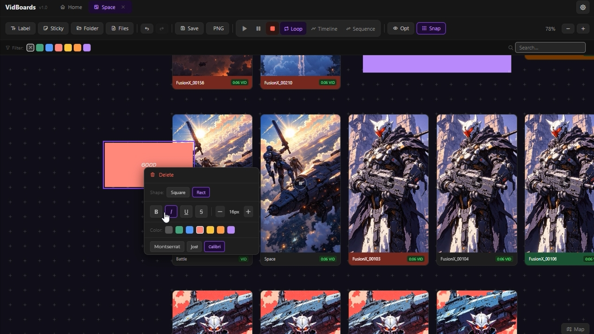

<p align="center">
  
</p>

<h1 align="center">VidBoards</h1>

<p align="center">
  Free canvas board for organizing videos and images.<br/>
  Drag, arrange, preview and play — fully offline, no account needed.
</p>

<p align="center">
  <a href="https://vidboards.app">
    
  </a>
  <a href="https://github.com/KuzmaBogdanov/vidBoards/releases/latest">
    
  </a>
  
  
</p>

---


Friends, hello everyone. <br>
Generating with local models, I often face an abundance of content coming out of different prompts and seed numbers, created during the search for the right generations. Reviewing files one by one or in a video editing program turned out to be problematic — sometimes you need to compare frame by frame, or watch a lot of material at once in search of the perfect one — this pushed me towards the idea of creating a board where all of this could be done. <br>
That's how VidBoards was born.
## Features

- **Works with any videos and images** — drag files directly onto the canvas
- **Reads metadata** (prompt, seed, workflow) from PNG, JPEG, MP4
- **Sequence mode** — flip through images one by one with keyboard
- **Timeline player** — plays all board videos simultaneously
- **Color filters, canvas search, multi-select**
- **Fully offline** — no cloud, no account, no telemetry

## Download

Go to [**Releases**](https://github.com/KuzmaBogdanov/vidBoards/releases/latest) and download the file for your platform:

| Platform | File |
|----------|------|
| Windows | `VidBoards-Setup-*.exe` |
| macOS | `VidBoards-*.dmg` |
| Linux | `VidBoards-*.AppImage` · `*.deb` · `*.rpm` |

## Installation

**Windows** — run the `.exe` installer.

**macOS** — open the `.dmg` and drag VidBoards to Applications. If Gatekeeper blocks it: right-click → Open.

**Linux (AppImage)**
```bash
chmod +x VidBoards-*.AppImage
./VidBoards-*.AppImage
```

**Linux (deb)**
```bash
sudo dpkg -i vidboards_*_amd64.deb
```

## Building from source

```bash
git clone https://github.com/KuzmaBogdanov/vidBoards.git
cd vidBoards
npm install
npm start
```

To build an installer:
```bash
npm run build        # Windows
npm run build:mac    # macOS
npm run build:linux  # Linux
```

## License

MIT © Kuzma Bogdanov
